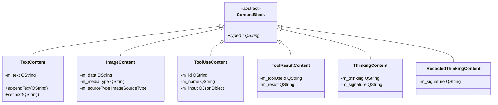

# Messages and content blocks

- **`BaseMessage`** -- accumulator for one streamed assistant turn. State machine: Building, RequiresToolExecution, Complete, Final. Holds an ordered list of `ContentBlock` objects.
- **`ContentBlock`** -- polymorphic model output: text, image, tool call, thinking, redacted thinking, tool result.

> `ContentBlock` = model **output**. `ToolContent` = tool **results**. Different directions. They meet in the continuation payload -- see [`tools.md`](tools.md) and [`../mcp/architecture/content-types.md`](../mcp/architecture/content-types.md).

---

## Message states

A `BaseMessage` moves through four states during its lifetime:

- **Building** -- the stream is still in progress and content blocks are being accumulated from incoming deltas.
- **RequiresToolExecution** -- the stream ended with one or more tool-use blocks. `BaseClient` will walk these blocks and dispatch them through `ToolsManager`.
- **Complete** -- the stream ended cleanly with no pending tool calls.
- **Final** -- terminal state after cleanup.

`BaseClient` inspects the state at two points: at end-of-stream (to decide whether to execute tools or complete normally) and during continuation (to read blocks before clearing the message for the next turn).

---

## BaseMessage

`BaseMessage` is the base class for per-provider streaming response parsers. It owns all `ContentBlock` instances (heap-allocated, deleted on destruction or when cleared for a continuation turn). Provider subclasses populate it by adding content blocks as SSE/JSON-lines events arrive.

The message exposes its current block list, and provides filtered accessors for tool-use blocks and thinking blocks. It also carries a raw stop-reason string that varies by provider -- each provider's message subclass sets it from the wire format. `BaseClient` captures this string before the message is cleaned up.

When a continuation turn begins, the message deletes all current blocks, empties its list, and resets to the Building state. Providers can override this reset to preserve cross-continuation state (for example, tracking how many thinking blocks have already been emitted).

---

## ContentBlock hierarchy



| Block | Carries | Producer |
|---|---|---|
| `TextContent` | Assistant text output, appended as deltas arrive | Every provider |
| `ImageContent` | Base64/URL image + media type | Rare -- some providers echo images back |
| `ToolUseContent` | Tool id, name, accumulated input JSON | Tool-calling providers. Flips state to RequiresToolExecution |
| `ToolResultContent` | Tool-use id + flattened text result | Rarely seen on streamed input |
| `ThinkingContent` | Reasoning text + signature bytes | Claude, OpenAI Responses |
| `RedactedThinkingContent` | Opaque signature, no text | Claude (safety redaction) |

### Extending

```cpp
class CitationContent : public ContentBlock
{
public:
    explicit CitationContent(QString url, QString title)
        : m_url(std::move(url)), m_title(std::move(title)) {}
    QString type() const override { return "citation"; }
private:
    QString m_url, m_title;
};
```

Teach the provider's `BaseMessage` subclass to emit the new block, and teach consumers (continuation payload builder, UI) to handle it. No copy/move operators -- blocks are heap-allocated and reached via non-owning pointers.

---

## Blocks to continuation payload

When a response contains tool-use blocks, `BaseClient` walks them and dispatches each tool call through `ToolsManager`. Once all tools complete, the collected results are handed to the provider's continuation builder along with the original payload and the current message state. The provider reconstructs the assistant turn from the message's content blocks and builds a new user turn containing the tool results. Rich providers (Claude, Google, OpenAI Responses) preserve image blocks in the continuation; text-only providers (OpenAI Chat, Ollama) flatten rich content to text descriptions. The new payload is then re-posted, and the message is cleared for the next streaming turn.
