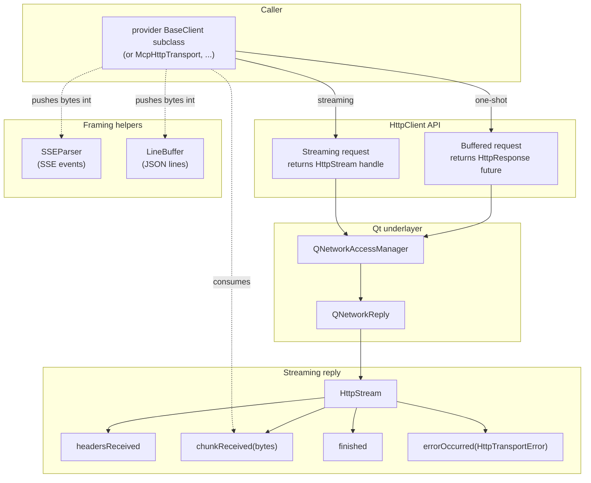

# Networking layer

Sits between provider clients and `QNetworkAccessManager`. Two goals:

1. Two shapes: buffered `HttpResponse` (one-shot) and streaming `HttpStream` (SSE).
2. Transport errors (`HttpTransportError`) vs HTTP status codes (`HttpResponse`) kept separate.

LLM-agnostic -- knows nothing about JSON, SSE events, MCP. Also backs `McpHttpTransport`.

---

## HttpClient

Wraps one `QNetworkAccessManager`. Must be used from the owning thread.

`HttpClient` provides two modes of operation. The **buffered** mode returns a future that resolves to an `HttpResponse` containing the status code, headers, and body. Any HTTP status (including 4xx/5xx) produces a valid response; only transport-level failures (DNS, timeout, SSL, abort, connection refused) propagate as exceptions. This mode is used for model listing, MCP HTTP transports, and non-streamed endpoints. The **streaming** mode returns a live `HttpStream` handle (caller takes ownership) used for all streamed LLM requests and HTTP MCP client transport.

Additional configuration includes proxy settings (forwarded to the underlying network manager) and a transfer timeout (default 120 seconds, can be disabled).

---

## HttpStream

`HttpStream` represents a long-lived streaming HTTP reply. It emits a sequence of signals: headers-received (after which the status code and headers are accessible), zero or more chunk-received events carrying raw bytes, and exactly one terminal event -- either a clean finish or a transport error. After an abort, neither terminal event fires.

Status code, raw headers, content type, and completion state are accessible once headers have arrived.

---

## SSEParser

Incremental, spec-compliant (WHATWG HTML section 9.2) Server-Sent Events parser. Accepts byte chunks and returns completed events, each carrying a type (defaulting to "message"), data (multi-line joined), and an optional ID. Supports flushing at end-of-stream, clearing between independent streams, and formatting events for the inverse direction (used by `McpHttpServerTransport`). A configurable buffer size limit (default 16 MiB) protects against memory exhaustion.

Used by all providers except Ollama.

---

## LineBuffer

Newline-framed buffer for Ollama's JSON-lines protocol. Accepts byte chunks and returns complete lines, holding any incomplete trailing bytes across calls. Intentionally separate from `SSEParser` by design.

---

## Error taxonomy

### Transport errors

`HttpTransportError` represents a transport-level failure that prevents an HTTP response from being received. It derives from `QException` and carries a human-readable message plus the underlying network error code. Transport errors cover DNS failures, timeouts, SSL errors, aborted connections, and connection refused. The dividing line between transport errors and HTTP responses is based on the network error code category -- low-level network failures are transport errors, while anything that produced an HTTP status code is delivered as an `HttpResponse`.

### HTTP error responses

Non-2xx HTTP responses are represented as normal `HttpResponse` values carrying the status code, headers, and body. Provider clients inspect these and run them through a provider-specific error parser to extract a meaningful error message. The default parser produces a message containing the HTTP status code and a truncated body snippet. Providers override this to handle their specific error envelope formats (Anthropic, OpenAI, Google, Ollama each have different shapes).
