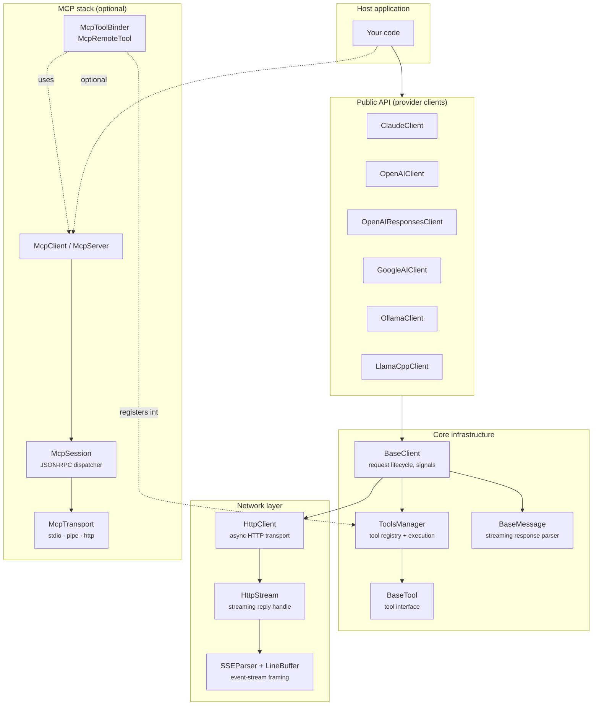

# Architecture overview

Two independent stacks meeting in `ToolRegistry` / `ToolsManager`:

1. **LLM provider stack** -- HTTP chat completion APIs, streaming, tool-call loops.
2. **MCP stack** -- Model Context Protocol over stdio / pipe / HTTP, client and server roles.

`McpRemoteTool` is a `BaseTool` subclass registered into `ToolRegistry` (or `ToolsManager`) via `McpToolBinder` -- provider clients see no difference between local and remote tools.



---

## Source layout

```
include/LLMQore/
├── BaseClient.hpp               ← provider-stack base
├── BaseMessage.hpp              ← streaming parser base
├── BaseTool.hpp                 ← tool interface
├── ContentBlocks.hpp            ← model-output content shapes
├── HttpClient.hpp               ← transport primitive
├── HttpStream.hpp               ← streaming reply handle
├── HttpResponse.hpp             ← buffered reply value
├── HttpTransportError.hpp       ← typed transport error
├── SSEParser.hpp                ← Server-Sent Events framer
├── LineBuffer.hpp               ← JSON-lines framer (Ollama)
├── ToolRegistry.hpp             ← tool storage base class
├── ToolsManager.hpp             ← extends ToolRegistry + schema + exec queue
├── ToolResult.hpp               ← rich tool result envelope
├── ToolSchemaFormat.hpp         ← per-provider schema enum
├── ClaudeClient.hpp, OpenAIClient.hpp, ...
├── Mcp*.hpp                     ← MCP stack public headers
├── BasePromptProvider.hpp, BaseResourceProvider.hpp,
│   BaseRootsProvider.hpp, BaseElicitationProvider.hpp
└── Clients, Core, Mcp, Network, Tools  ← umbrella headers

source/
├── core/          BaseClient.cpp, BaseMessage.cpp, Log.cpp
├── clients/       claude/, openai/, google/, ollama/, llamacpp/
├── network/       HttpClient.cpp, HttpStream.cpp, SSEParser.cpp,
│                  LineBuffer.cpp, HttpRequestParser.cpp,
│                  HttpResponse.cpp, HttpTransportError.cpp
├── tools/         BaseTool.cpp, ToolRegistry.cpp, ToolsManager.cpp, ToolResult.cpp,
│                  ToolHandler.{hpp,cpp}
└── mcp/           everything MCP-related
```

Each `source/clients/<vendor>/` holds the `*Client.cpp` + `*Message.{hpp,cpp}` pair. The `OpenAI` folder has two pairs: Chat Completions and Responses.

---

## Invariants

- **Provider clients never talk to `McpSession` directly.** MCP tools appear as ordinary `BaseTool` instances in `ToolRegistry`/`ToolsManager` via `McpRemoteTool`. The provider layer is unaware of their origin.
- **`HttpClient` knows nothing about LLMs, JSON, or MCP.** It is a pure HTTP transport. Only DNS, timeout, SSL, abort, and connection-refused failures surface as transport errors; all HTTP status codes are passed through as response values.
- **`McpTransport` is the only byte-level boundary** on the MCP side. Everything above it operates on parsed JSON objects.
- **`McpServer` depends on `ToolRegistry`, not `ToolsManager`** -- no `ToolSchemaFormat` needed for MCP servers.
- **One `ToolsManager` holds tools from multiple sources** (local and MCP), and they are indistinguishable to the continuation payload builder.
- **The SSE parser is spec-compliant and shared** across all providers except Ollama, which uses a JSON-lines framer instead.
- **In-flight request state is centralized** in a single request map inside `BaseClient`. Each entry holds the stream, buffers, original payload for continuations, a continuation counter, and the stop reason. Progress and completion reach the host via signals (`chunkReceived`, `requestCompleted`, `requestFinalized`, `requestFailed`, ...), not per-request callback structs.
- **Tool continuations are bounded** to a fixed maximum (10) to prevent runaway loops.
