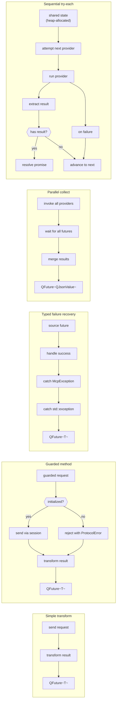

# Async chain model

No `QFutureWatcher + QPromise + deleteLater` by hand in the MCP layer. Only these patterns:

## Patterns

1. **Simple transform** — used by tool listing, prompt retrieval, etc. Parse JSON response into typed result.

2. **Guarded method** — all initialized-only operations go through an initialization check first.

3. **Typed failure recovery** — used by handshake and remote tool execution. First handler catches MCP-specific exceptions (preserves concrete type); second catches generic exceptions and normalises to McpException.

4. **Parallel collect** — McpServer collects from all providers in parallel, merges into a single JSON array. Used for `resources/list`, `resources/templates/list`, `prompts/list`, `completion/complete`.

5. **Sequential try-each** — McpServer tries providers one at a time until one returns a result. Heap-allocated shared state with recursive chaining. Used for `resources/read`, `prompts/get`.

## Rules for new code

- **Always pass `this` as context** to `.then(ctx, lambda)` and `.onFailed(ctx, lambda)` — Qt context-aware disconnection.
- **Never manually `new QFutureWatcher`** — use `.then()` chain instead.
- **`e.raise()` to re-propagate** — `std::make_exception_ptr(e)` silently slices.
- **Long-running state across suspensions** — `std::shared_ptr` on heap, captured by value. Only justified for complex flows like `TryEachState`.
