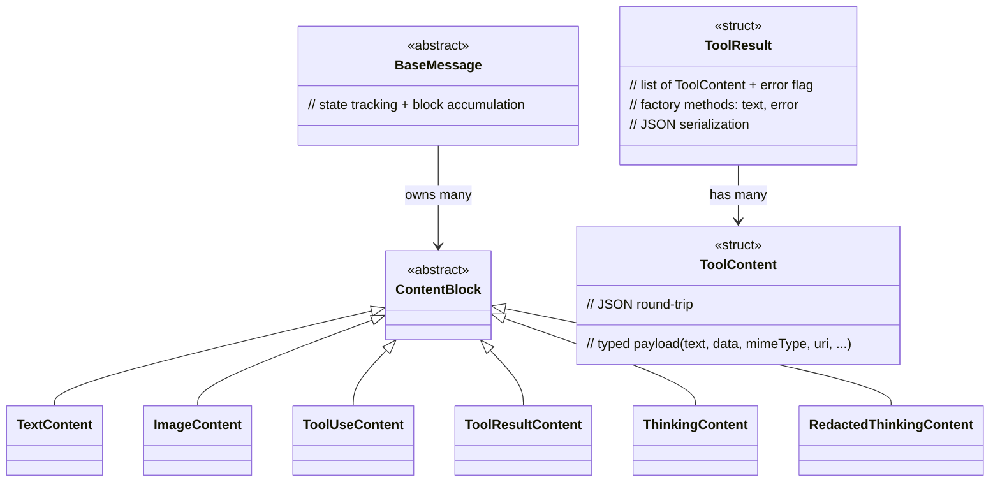

# Content type hierarchy

Two separate hierarchies:

- **`ContentBlock` family** (`ContentBlocks.hpp`) — model **output** segments in `BaseMessage`. Polymorphic, heap-allocated, `QList<ContentBlock *>`.
- **`ToolContent` + `ToolResult`** (`ToolResult.hpp`) — tool **results**. Value-typed, JSON-serialised, matches MCP `tools/call` wire format.

## How the two hierarchies meet

1. `BaseMessage` accumulates `ContentBlock` instances during SSE stream.
2. Stream ends with `RequiresToolExecution` → `BaseClient` walks `ToolUseContent` → `ToolsManager`.
3. Tools run → `toolExecutionComplete(requestId, QHash<QString, ToolResult>)`.
4. `buildContinuationPayload` uses **both**: assistant turn from `BaseMessage` blocks + user turn from `ToolResult` envelopes. Rich providers (Claude, OpenAI Responses, Google) preserve images; text-only (Ollama, OpenAI Chat) flatten via `asText()`.

## Extending

- **New model output shape** (e.g. thinking variant) → add `ContentBlock` subclass, teach provider's `BaseMessage` parser.
- **New tool result shape** (e.g. video) → add `ToolContent::Type` value, teach each provider's `createToolResult*` methods. MCP wire layer handles it automatically via `ToolResult::toJson()`.
