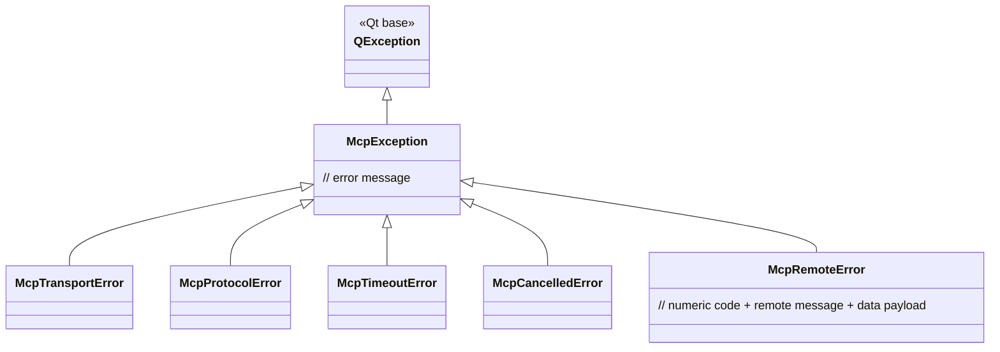

# MCP exception hierarchy

All MCP errors propagate as `McpException` subclasses. Inherits `QException` — flows through `QFuture`/`.onFailed()` with full type preservation.

## Meanings

| Exception | When |
|---|---|
| `McpTransportError` | Transport not open, network down, subprocess died, SSE stream broke |
| `McpProtocolError` | Invalid JSON-RPC envelope, unknown method, invalid state |
| `McpTimeoutError` | Request exceeded `sendRequest` timeout |
| `McpCancelledError` | Peer sent `notifications/cancelled`, or `cancelRequest` called |
| `McpRemoteError` | Peer replied with JSON-RPC `error` object. Carries numeric `code`, remote `message`, `data` payload. Typically the one to catch separately in user code |

Every subtype implements `raise()` + `clone()` correctly — `.onFailed(ctx,  {...})` matches the concrete subtype without slicing.
