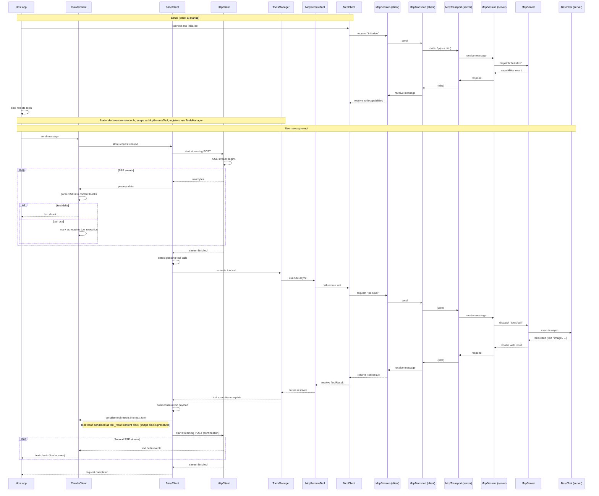

# End-to-end request flow

User prompt → model calls remote MCP tool → conversation continues.

## Invariants

- Provider client never learns the tool came from MCP — `McpRemoteTool *` occupies the same `BaseTool *` slot.
- Second HTTP request is a new streaming call from `buildContinuationPayload`. Up to 10 continuations per prompt.
- Server-side `BaseTool` sees the same `QFuture<ToolResult>` contract as a local tool.
